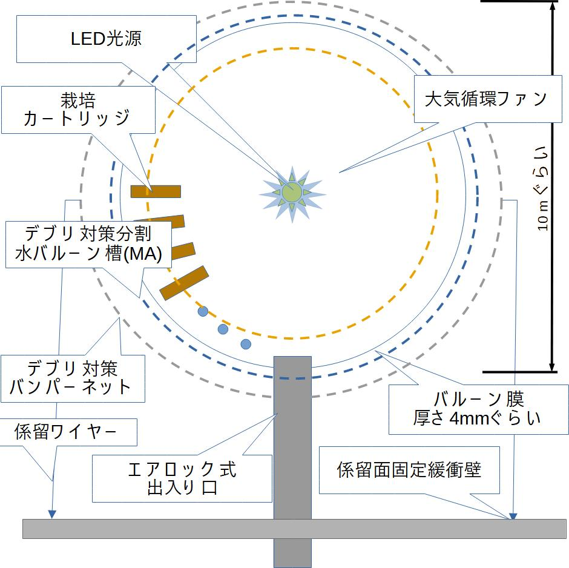
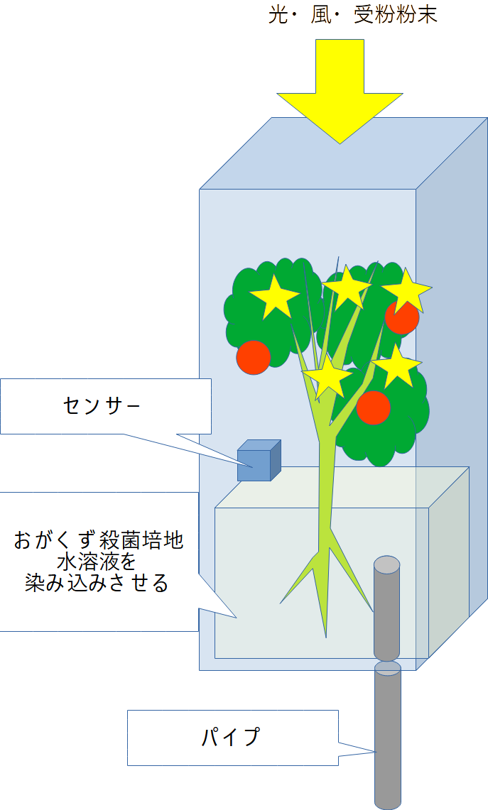
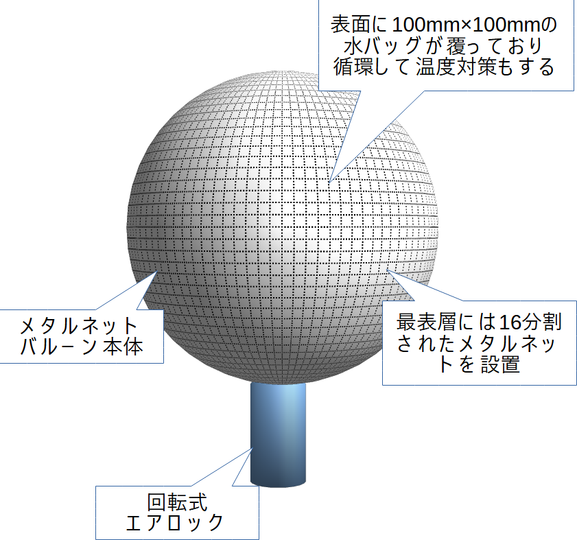
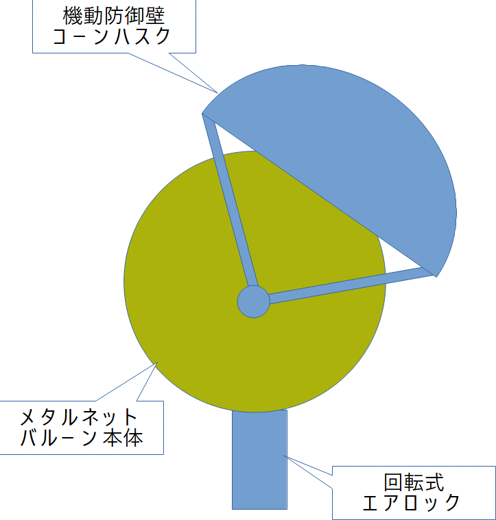
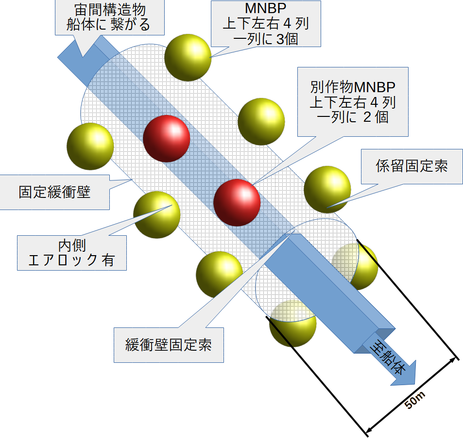
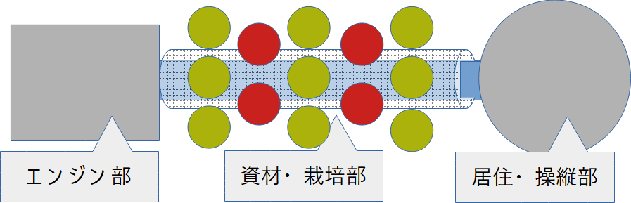

# 宇宙農園構想同人誌
## Readme

## 最初に
宇宙で生活する際に、重大な消耗資材である食糧を継続可能な自給できれば長期滞在に役立つことは言を待たないだろう。

地球上から宇宙空間に資材を運ぶには、現状ではロケットのような高価かつ貴重な手段を使う必要があるからである。

長期滞在の是非はともかく、観測や研究など宇宙空間にて滞在しなければいけない人間に対するとても重要な要素である。

また、この技術は地球上でも気候変動や災害・シェルター退避など過酷な環境にて食糧を自給できる手段を広げる事にも応用できるため、決して無駄にはならない。

## 農業プラントの必要性
化学的合成で作られる栄養剤は
容易に合成できるのが利点であるが
人間のメンタルに影響する。（ディストピア飯と呼ばれる）

畜産・養殖は
多くの植物資材を消耗するため現実的でない
(食肉1kg生産に牛肉は11kg、豚肉6㎏、鶏肉4㎏の穀物が必要　農水省資料）

以上の事により
専用プラントにおける農業
が適していると考えられる。

### 隣接惑星へ行くために長期滞在を強いられるケース

例えば月から火星まで5500万kmを現在の技術を使って行くと約250日(NASAの試算)かかるため現在の宇宙食にて全て賄うのは現実的ではない(一人当たり0.6×250日=150kg+リサイクル水)と考えられる。
全行程3年かかるという試算もある。

この期間、ディストピア飯のような食事が続く可能性があると考えると寒気がするのは私だけだろうか。

現在の宇宙食はレトルトパックや缶が主流だが、2024年に能登半島地震救援炊き出しへ行った経験からレトルト・インスタント食品が中心の食事が数か月続き苦悩を語る被災者が多かったように思える。

高い志を持ち訓練をされた自衛隊でも缶飯といった携行食が続くと嫌になる(それでも海外のレーションよりはましだそうだ)という元隊員の証言も非公式ながらある。食の問題はそれだけ人間のメンタルに深刻な影響を与えるのだ。

## 農業プラントにおける諸問題

農業プラントは
大きな空間が必要だが
現用往還機の一度に扱えるスペースは限られる。(HTVは直径4m)
宇宙空間ではデブリ対策も考慮する必要がある。

そのため、空間とデブリ対策の双方を満たす解決策として
「メタルネットバルーンプラント」
を提案したい。
農業プラントには人間の居住区ほど強固にデブリ等から守る優先度が低いと考えるためである。

## これがメタルネットバルーンプラント（MNBP)だ！

輸送時は小さく、展開時は充分な大きさの球形となり設備ユニットへ係留する。
内部は植物向けの大気(CO2等)を充填するため、エアロックは必要だが内部作業時は宇宙服や気密服が必要。原則遠隔ロボットで作業をすることとなる。

  

### メタルネットバルーンプラント 仕様
直径 10m
栽培モジュール x 314基
収量 314kg/60日(トマトの場合)
質量 40t
(内訳)
1.5t 栽培モジュール
6t  水
31t 武者鎧 
0.7tバルーン
1t 栽培施設
打ち上げコスト 500億円

### メタルネットバルーンプラント コスト計算
打ち上げコスト 500億円
破壊率 1%/年
耐用年数 10年
減価償却費 1500万円/日
生産量 
314kg/60日(トマト仕様)→ 5kg/日 
157kg/10日(シメジ仕様)→ 2.5kg/日
314kg/50日(エダマメ仕様)→ 6kg/日
314kg/180日(ムカゴ仕様)→ 1.5kg/日

## 内部に設置する栽培カートリッジ

内部幕にはw50cm×d50cm×h100cmの水耕栽培モジュールを設置。
作物の種類によって異なり、基本的に気密されない

中央空間にLED光源と大気・受粉粉末循環用ファンを設置する。LED光源の発熱問題が未解決だが、冷却放熱手段は今後検討したい。

  

## デブリについて
### デブリ速度は10km/s

戦車砲徹甲弾は2km/s

完全に防御しきるのは困難
デブリ類外壁貫通確率は年間1%
JAXAのISSモジュール「きぼう」運用データ

年間10個は貫通 / バルーンプラント1000個

### バルーン守るのではなく補修・再使用・リサイクルで

強固な外殻よりも
補修・再生しやすいバルーンタイプ
地球地表の温室もひょうの多い地域ではガラス製よりビニールハウスの方が再生容易
内部の栽培カートリッジも再生して使用

## 循環表層水防護膜「武者鎧」

### 居住ブロックではないためとして大規模な隔壁は設けない

年間1％程度の損失で済む程度にできるようスタッフィング入りバンパネットを16分割にてバルーンに覆う形で設置。

更にネットとバルーンの間に水タンクを兼ねた循環式水バルーン層「武者鎧」を31400分割にて配置する。

破壊されたバルーンは内部含めリサイクル処理に回す。
ネットと水バルーンは破損部を交換補修し再使用。

  

## 機動防護壁「コーンハスク」

デブリは宇宙構造物が周回・移動する際に進行方向から衝突するケースが多い。海水浴で海中のゴミに衝突するのを想像すると分かりやすいだろう。
その為進行方向に向けて強固な防御壁を可動させることが効果的だと考える。
宇宙船であれば言わずもがな、宇宙ステーションであっても姿勢制御により構造物の向きを変えなくてはいけないケースが想定される。

  

## 宇宙船に搭載モジュール化「ギャップコーンモジュール(GCP)」

### ギャップコーンモジュール(GCM)

図では GCM に MNBP  20 基搭載
全体規模
MNBPが1000基(100人分)
GCM だと 50基

  

## GCP宇宙船装着例

宇宙船のエンジン部と居住部の間をつなぐ区間に設置を想定した。

宇宙船への設置方法は様々であるが、デブリ防御しやすい形態を検討されたい。

また、このGCPは重力を必須としない。その為設置はきちんと固定出来回転エアロックと電気と水が供給できる構造であれば設置個所を選ばない。

  

