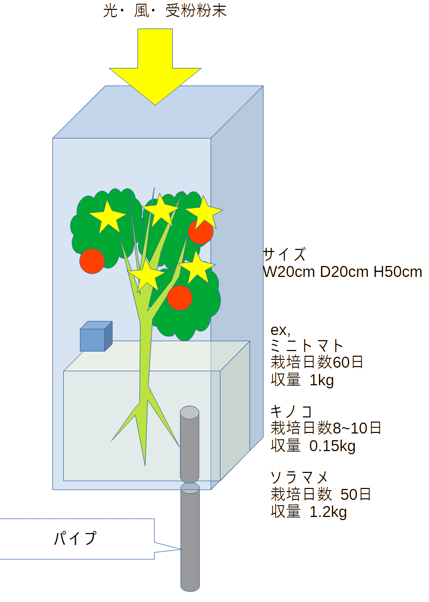

# spacefarm title
## first
地球の赤道半径 $6380km = 6.38\times10^{6}m$
植物工場を宇宙で稼働させる時の必要用件
これがメタルネットバルーンプラント（MNBP)だ！

輸送時は小さく、展開時は充分な大きさの球形となり設備ユニットへ係留する。
内部は植物向けの大気(CO2等)を充填するため、エアロックは必要だが内部作業時は宇宙服や気密服が必要。原則遠隔ロボットで作業をすることとなる。

  

内部に設置する栽培カートリッジ

内部幕にはw20cm×d20cm×h50cmの水耕栽培モジュールを設置。

作物の種類によって異なり、基本的に気密されない

中央空間にLED光源と大気・受粉粉末循環用ファンを設置する。

  

循環表層水防護膜「武者鎧」

更にネットとバルーンの間に水タンクを兼ねた循環式水バルーン層「武者鎧」を31400分割にて配置する。

破壊されたバルーンは内部含めリサイクル処理に回す。
ネットと水バルーンは破損部を交換補修し再使用。
  

  

  

  

