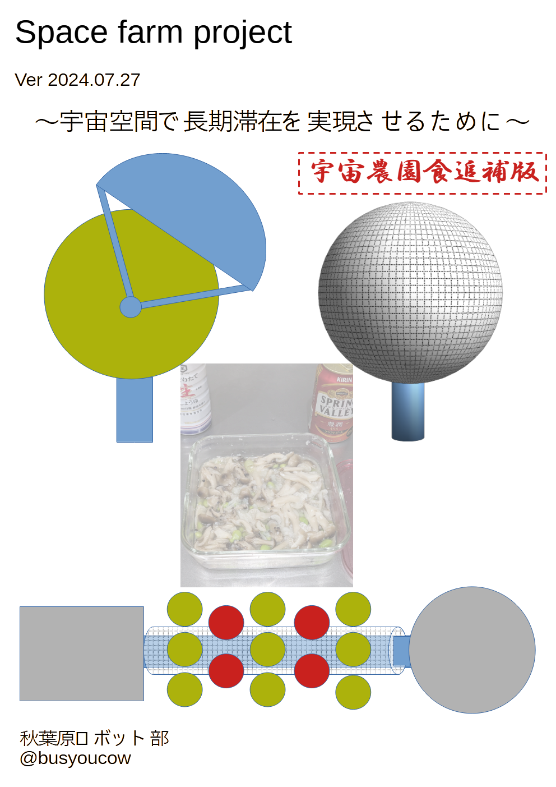
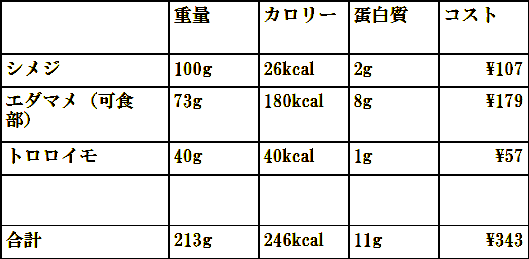
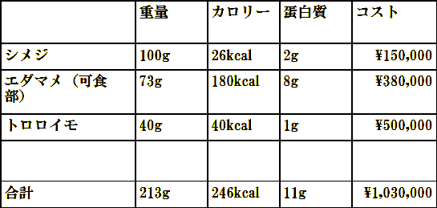
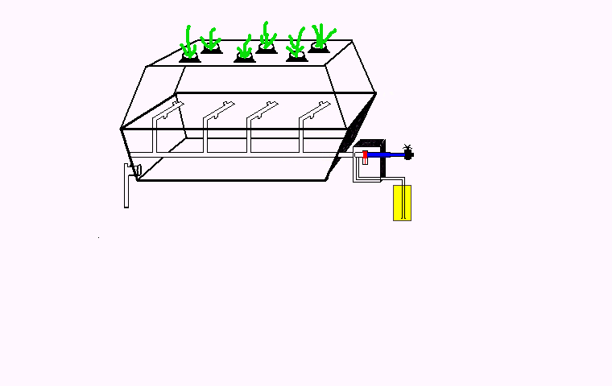

  

# まえがき
githubで最新のものが読めます。urlをブラウザに入力してアクセスしてください。(https://github.com/busyoucow/spacefarm)

ライセンスはMITです。

# 目次

- [まえがき](#まえがき)
- [目次](#目次)
- [最初に](#最初に)
  - [農業プラントの必要性](#農業プラントの必要性)
    - [隣接惑星へ行くために長期滞在を強いられるケース](#隣接惑星へ行くために長期滞在を強いられるケース)
- [農業プラントの構想](#農業プラントの構想)
  - [農業プラントにおける諸問題](#農業プラントにおける諸問題)
  - [これがメタルネットバルーンプラント（MNBP)だ！](#これがメタルネットバルーンプラントmnbpだ)
    - [メタルネットバルーンプラント 仕様](#メタルネットバルーンプラント-仕様)
    - [メタルネットバルーンプラント コスト計算](#メタルネットバルーンプラント-コスト計算)
  - [内部に設置する栽培カートリッジ](#内部に設置する栽培カートリッジ)
  - [デブリ対策](#デブリ対策)
    - [デブリ速度は10km/s](#デブリ速度は10kms)
    - [バルーン守るのではなく補修・再使用・リサイクルで](#バルーン守るのではなく補修再使用リサイクルで)
    - [循環表層水防護膜「武者鎧」](#循環表層水防護膜武者鎧)
    - [機動防護壁「コーンハスク」](#機動防護壁コーンハスク)
  - [宇宙船に搭載モジュール化「ギャップコーンモジュール(GCM)」](#宇宙船に搭載モジュール化ギャップコーンモジュールgcm)
    - [ギャップコーンモジュール(GCM)](#ギャップコーンモジュールgcm)
  - [GCM宇宙船装着例](#gcm宇宙船装着例)
- [宇宙農園で作るメニュー](#宇宙農園で作るメニュー)
  - [宇宙農園で作る作物は？](#宇宙農園で作る作物は)
  - [作物の選択](#作物の選択)
  - [宇宙農園メニューの試作](#宇宙農園メニューの試作)
    - [用意する材料](#用意する材料)
    - [作り方](#作り方)
    - [キノコの処理](#キノコの処理)
    - [素材の組み合わせ](#素材の組み合わせ)
    - [混ぜて寝かせ](#混ぜて寝かせ)
    - [加熱して完成](#加熱して完成)
  - [カロリーとコスト考察](#カロリーとコスト考察)
  - [味と今後の課題](#味と今後の課題)
  - [宇宙酵母菌の可能性について](#宇宙酵母菌の可能性について)
    - [宇宙生活で不足するタンパク質](#宇宙生活で不足するタンパク質)
    - [酵母で補うには？](#酵母で補うには)
    - [問題点](#問題点)
    - [解決策](#解決策)
    - [良質なタンパク質を得るために](#良質なタンパク質を得るために)
  - [HM（ハイパーマテリアル）について](#hmハイパーマテリアルについて)
- [あとがき](#あとがき)

# 最初に
宇宙で生活する際に、重大な消耗資材である食糧を継続可能な自給できれば長期滞在に役立つことは言を待たないだろう。

地球上から宇宙空間に資材を運ぶには、現状ではロケットのような高価かつ貴重な手段を使う必要があるからである。

長期滞在の是非はともかく、観測や研究など宇宙空間にて滞在しなければいけない人間に対するとても重要な要素である。

また、この技術は地球上でも気候変動や災害・シェルター退避など過酷な環境にて食糧を自給できる手段を広げる事にも応用できるため、決して無駄にはならない。

## 農業プラントの必要性
化学的合成で作られる栄養剤は
容易に合成できるのが利点であるが
人間のメンタルに影響する。（ディストピア飯と呼ばれる）

畜産・養殖は
多くの植物資材を消耗するため現実的でない
(食肉1kg生産に牛肉は11kg、豚肉6㎏、鶏肉4㎏の穀物が必要　農水省資料）

以上の事により
専用プラントにおける農業
が適していると考えられる。

### 隣接惑星へ行くために長期滞在を強いられるケース

例えば月から火星まで5500万kmを現在の技術を使って行くと約250日(NASAの試算)かかるため現在の宇宙食にて全て賄うのは現実的ではない(一人当たり0.6×250日=150kg+リサイクル水)と考えられる。
全行程3年かかるという試算もある。

この期間、ディストピア飯のような食事が続く可能性があると考えると寒気がするのは私だけだろうか。

現在の宇宙食はレトルトパックや缶が主流だが、2024年に能登半島地震救援炊き出しへ行った経験からレトルト・インスタント食品が中心の食事が数か月続き苦悩を語る被災者が多かったように思える。

高い志を持ち訓練をされた自衛隊でも缶飯といった携行食が続くと嫌になる(それでも海外のレーションよりはましだそうだ)という元隊員の証言も非公式ながらある。食の問題はそれだけ人間のメンタルに深刻な影響を与えるのだ。

# 農業プラントの構想

## 農業プラントにおける諸問題

農業プラントは
大きな空間が必要だが
現用往還機の一度に扱えるスペースは限られる。(HTVは直径4m)
宇宙空間ではデブリ対策も考慮する必要がある。

そのため、空間とデブリ対策の双方を満たす解決策として
「メタルネットバルーンプラント」
を提案したい。
農業プラントには人間の居住区ほど強固にデブリ等から守る優先度が低いと考えるためである。

## これがメタルネットバルーンプラント（MNBP)だ！

輸送時は小さく、展開時は充分な大きさの球形となり設備ユニットへ係留する。
内部は植物向けの大気(CO2等)を充填するため、エアロックは必要だが内部作業時は宇宙服や気密服が必要。原則遠隔ロボットで作業をすることとなる。

  

### メタルネットバルーンプラント 仕様
- 直径 10m
- 栽培モジュール x 314基
- 収量 314kg/60日(トマトの場合)
- 質量 40t
- (内訳)
- 1.5t 栽培モジュール
- 6t  水
- 31t 武者鎧 
- 0.7tバルーン
- 1t 栽培施設
- 打ち上げコスト 500億円

### メタルネットバルーンプラント コスト計算
- 打ち上げコスト 500億円
- 破壊率 1%/年
- 耐用年数 10年
- 減価償却費 1500万円/日
- 生産量 
- 314kg/60日(トマト仕様)→ 5kg/日 
- 157kg/10日(シメジ仕様)→ 2.5kg/日
- 314kg/50日(エダマメ仕様)→ 6kg/日
- 314kg/180日(ムカゴ仕様)→ 1.5kg/日

## 内部に設置する栽培カートリッジ

内部幕にはw50cm×d50cm×h100cmの水耕栽培モジュールを設置。
作物の種類によって異なり、基本的に気密されない

中央空間にLED光源と大気・受粉粉末循環用ファンを設置する。LED光源の発熱問題が未解決だが、冷却放熱手段は今後検討したい。

  

## デブリ対策
### デブリ速度は10km/s

戦車砲徹甲弾は2km/s

完全に防御しきるのは困難
デブリ類外壁貫通確率は年間1%
JAXAのISSモジュール「きぼう」運用データ

年間10個は貫通 / バルーンプラント1000個

### バルーン守るのではなく補修・再使用・リサイクルで

強固な外殻よりも
補修・再生しやすいバルーンタイプ
地球地表の温室もひょうの多い地域ではガラス製よりビニールハウスの方が再生容易
内部の栽培カートリッジも再生して使用

### 循環表層水防護膜「武者鎧」

居住ブロックではないためとして大規模な隔壁は設けない

年間1％程度の損失で済む程度にできるようスタッフィング入りバンパネットを16分割にてバルーンに覆う形で設置。

更にネットとバルーンの間に水タンクを兼ねた循環式水バルーン層「武者鎧」を31400分割にて配置する。

破壊されたバルーンは内部含めリサイクル処理に回す。
ネットと水バルーンは破損部を交換補修し再使用。

  

### 機動防護壁「コーンハスク」

デブリは宇宙構造物が周回・移動する際に進行方向から衝突するケースが多い。海水浴で海中のゴミに衝突するのを想像すると分かりやすいだろう。
その為進行方向に向けて強固な防御壁を可動させることが効果的だと考える。
宇宙船であれば言わずもがな、宇宙ステーションであっても姿勢制御により構造物の向きを変えなくてはいけないケースが想定される。

  

## 宇宙船に搭載モジュール化「ギャップコーンモジュール(GCM)」

### ギャップコーンモジュール(GCM)

図では GCM に MNBP  20 基搭載
全体規模
MNBPが1000基(100人分)
GCM だと 50基

  

## GCM宇宙船装着例

宇宙船のエンジン部と居住部の間をつなぐ区間に設置を想定した。

宇宙船への設置方法は様々であるが、デブリ防御しやすい形態を検討されたい。

また、このGCMは重力を必須としない。その為設置はきちんと固定出来回転エアロックと電気と水が供給できる構造であれば設置個所を選ばない。

  

# 宇宙農園で作るメニュー

## 宇宙農園で作る作物は？

人間の長期滞在を安心・安定的に実現するには、植物を農業プラントにて生産して調理する必要がある。これは人間のメンタル維持にも必要なことであり、更に宇宙空間では地球環境を大規模に模倣しない限り水耕栽培が主となるため、それを考えた作物とメニューを選択する必要がある。

## 作物の選択

作物は水耕栽培が前提のため菌類と芋類(根菜は不可のためむかご)、豆類それと酵母を選択し加熱調理したスープソテーを提案したい。糖類とタンパク質、繊維質を含み咀嚼を楽しめる為である。

- 現代の地上で揃えるならば
- シメジ           100g      26kcal    2g
- エダマメ可食部    73g     180kcal    8g
- トロロイモ        40g     40kcal     1g

- 合計                     246kcal   11g

- 宇宙植物工場で揃えると
- シメジ           100g      26kcal    2g
- エダマメ可食部    73g      180kcal    8g
- ムカゴ            40g      40kcal    1g

- 合計                      296kcal  11g

一食当たりの炭水化物カロリーが低いことが目につく。
ジャガイモを水耕栽培するエアポニックス技術をKIRINが研究しているためこれが採用できるのを期待したい。

## 宇宙農園メニューの試作

### 用意する材料
  

シメジ　一株
ゆで枝豆　1パック
とろろ芋　1パック
塩こうじ　適量
キリンスプリングバレー　1缶(酵母の代用)
他に食塩を使用

### 作り方

  

ゆで枝豆は鞘から豆を取り出す。
この時点で質量は半分ほどになる。
むかごは季節ではなく入手できなかったため、冷凍山芋パックを使用。

### キノコの処理

  

パックのブナシメジを洗浄して切っていく。
石突の部分は除去。
洗うと水を含み重量が増加した。耐熱容器に入れていく。

### 素材の組み合わせ

  

鞘から取り出した枝豆を入れる。
山芋パックを入れる。
塩こうじを入れていく。10g程度か。塩もこの段階で少し振っておく

### 混ぜて寝かせ

  

これらを混ぜておく。
冷蔵庫で30分ほど寝かせて、味をなじませる。

### 加熱して完成

  

電子レンジで5分加熱したあと、3分おいて中まで熱を通す。
更に電子レンジで3分加熱する。醤油は味を見て適宜使用。
これで完成。キリンスプリングバレーは酵母菌補給のために添えた。

## カロリーとコスト考察
カロリー値偏重はよくないが、やはり宇宙空間という隔離空間ではコストとカロリーは切り離せない。ここで考察する。
地上で用意した場合
  

宇宙で用意した場合
  

こうして考えてみると、やはり炭水化物由来のカロリーが不足気味でコストも高い（育成期間がかかるため）のでその部分は解決が必要であろう。

## 味と今後の課題
ちゃんと火が通っているので安全安心、お腹にもたまるように思えた。しかし…
よく言えば「素材の風味が生きている」正直に言えば「味が単調で薄い！」と感じる。
写真に映っている醤油が大いに助けとなった。
意識高い系の人ならばヘルシー！で良いと感じるかもしれないが、中年男性には物足りない味付けになったと感じる。しかし食感はいい感じであった。うまみもある。
あと、枝豆はスーパーの常温品なので既に塩ゆでしてあります…生豆を使う場合はその辺りも考慮する必要がある。
次回はオーブンでホイル焼きも検討したい。

## 宇宙酵母菌の可能性について
### 宇宙生活で不足するタンパク質
1日60ｇ必要※１　1食当たり20ｇ※2
エネルギーは１日2650kcal、1食当たり884kcal
以前のレシピでは蛋白質９ｇ、エネルギー638kcal不足する。
これを解決するには？まずは蛋白質を考えてみる

※1　月面農場ワーキンググループ, 2019, 月面農場ワーキンググループ検討報告書 第1版: 宇宙航空研究開発機構(JAXA), 25 p. 

※2　Space farm project ～宇宙空間で長期滞在を実現させるために～　ver 2024.7.27 21p

### 酵母で補うには？
ビール酵母（ASAHI EBIOS ビール酵母粉末タイプ）の場合　55g/100g の為9g補うには約16g必要。大さじ1が約15gなため1と1/8必要となる。しかしこれでは味覚に大きな影響が出てしまう。
ドライイーストの場合　2割増しでないといけないため約20g、大さじ1と1/3必要である。

### 問題点
宇宙で畜産を行うのは飼料効率が悪いため除外
植物性タンパク質だけでは健康に影響するという説がある。
動物性タンパク質生産には魚類養殖もあるがプラントが比較的大型になるため初期は難しい
酵母菌なら培養槽で増やせるが味が良くない

### 解決策
宇宙生産初期で有望なのは酵母菌だが味覚に難がある。これを精神論で我慢させるのは前時代的のためレシピで解決したい。
中期になれば空間を確保して魚類回遊養殖槽を設置するのも良いかもしれない。
また味に影響を与えにくい酵母菌の発見も待たれる。納豆菌も有望（アミノ酸組成タンパク質14.5g/100g）※1

※1　 出典：日本食品標準成分表（八訂）増補2023年

### 良質なタンパク質を得るために
宇宙空間ではキノコ類も含め菌類の活用が有望であると考える。キノコ活用レシピは拙稿SpaceFarmProjectを参照されたい。
菌類は一度死滅させてしまうと再生が困難である為定期的に菌種確保する必要があると考える
宇宙空間での生活は過酷になると考えられるため数少ない楽しみとして食の充実を考えたい。

## HM（ハイパーマテリアル）について
HMは炭水化物と糖類を楽しみながら摂取する食材として有望である。

世間ではパンケーキミックスとして売られているため入手はしやすいが、宇宙空間では小麦生産は比較的大規模な施設で長期間必要とされるため入手難易度が高い。

それを改善する為大豆粉＋馬鈴薯でんぷんを使用するHMを推奨したい。（馬鈴薯もエアポニックス技術が必要ではあるが生産期間が短め）
タンパク質約20g/100gの為大豆粉で2割ほど炭水化物を節約できる（マルコメダイズラボ大豆粉でおいしいパンケーキミックス使用）

# あとがき

今回の拙稿は秋葉原ロボット部2024年6月定例会にて発表した資料に加筆修正を行ったものである。

更に2024年6月29日に開催されたABC（Android Bazzerl Conference）にて追補を行っている。

また、2024年7月27日に開催されるOSC(Open Source Conference) 2024 Kyoto 向けに修正を行った。

既にロボット部総統(@nanbuwks)より各種指摘を受けているが、現在までの予想図として寄稿した。

宇宙関連は様々な技術と知見の総合格闘技である。そこへ一介の素人が妄想した「未来想像図」として御笑覧されたい。

もしこうしたい等の知見や研究があるならば、我々にぜひ拝見の機会を頂きたく思う。食糧問題は喫緊の課題であり解決できるソリューション案は多いに越したことはないからである。

今こそ人類の英知を結集する必要があると考え、本稿が結集のためのたたき台になることを願いつつ筆を置く。

…俺たちのたたかいはこれからだ！

 

 
 
 

  

 
 
 
 
 
 
 

|SpaceFarmProject|||Ver.20240727|
|:---|:---|:---|:---|
|2024年6月22日 初版||||
|2024年7月27日 追補３版||||
|著者 @busyoucow (Secret Societies OpenForce)||||
|||||